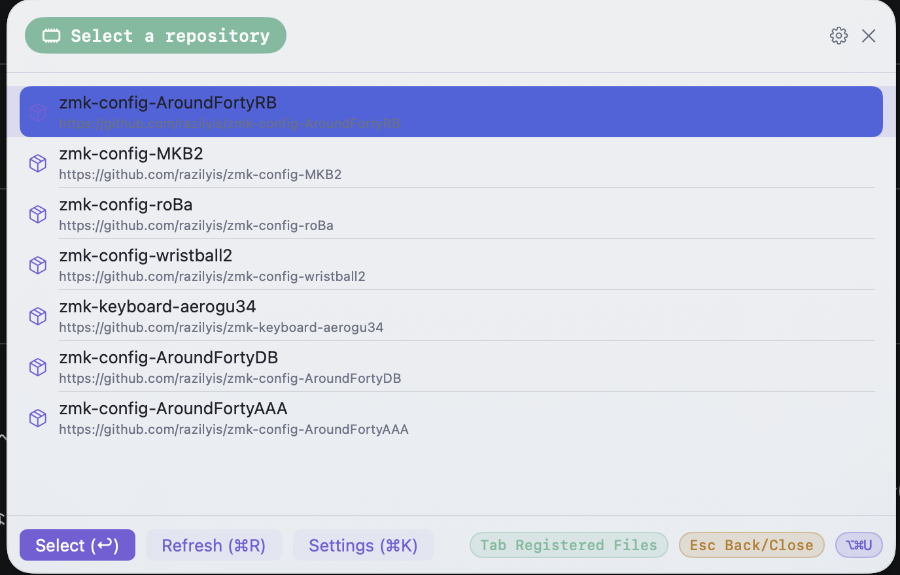
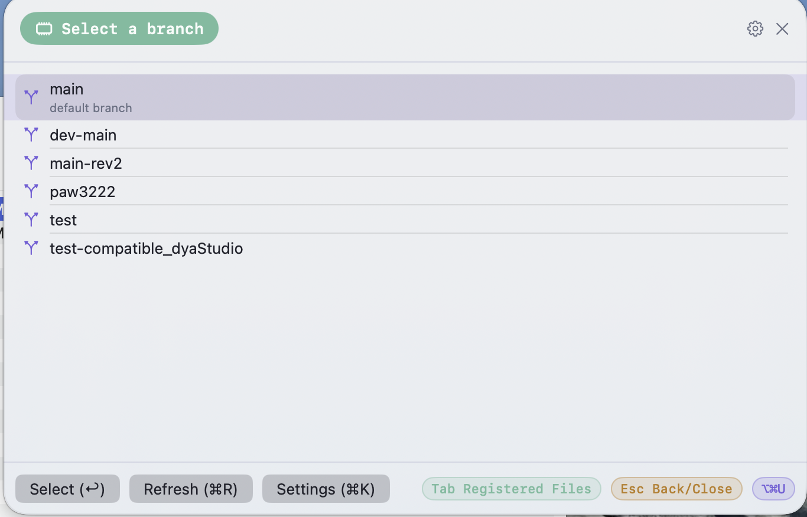

# AutoFlash for ZMK

A lightweight macOS menu bar utility for flashing firmware to split keyboards running ZMK (UF2 bootloader devices).

The core idea: flash firmware without ever touching the mouse. Press a hotkey, arrow through the list, hit Return — done. No Finder, no drag-and-drop, no clicking through a GUI.

日本語版: [README.ja.md](README.ja.md)

The feature set is intentionally kept to just two things:

1. **Registered File Flash** — flash a `.uf2` file you've registered locally, with one hotkey (default `⌥⌘F`)
2. **GitHub Firmware Flash** — automatically download the latest `.uf2` from a GitHub Actions artifact in a repository you've registered, then flash it (default `⌥⌘U`)

## Disclaimer

This app writes directly to your keyboard's bootloader. **Use it entirely at your own risk.** The author(s) provide no warranty and accept no responsibility for any damage, malfunction, bricked hardware, data loss, or other issues that result from using this software. See the [LICENSE](LICENSE) for the full "AS IS" terms.

## Screenshots

| Repository | Branch |
| --- | --- |
|  |  |

## Requirements

- macOS 15.0 or later
- Swift 6 toolchain (Xcode 16+, or a standalone Swift 6 toolchain)

## Install

### Download a release

Download the `.dmg` from the [Releases](../../releases) page, open it, and drag `AutoFlash for ZMK.app` into `Applications`.

The app is only ad-hoc signed (`codesign --sign -`), not notarized by Apple. Since macOS flags anything downloaded from the internet with a quarantine attribute, a plain double-click will be blocked by Gatekeeper as "from an unidentified developer." **Right-click (or Control-click) the app → Open** the first time to bypass this; after that it launches normally.

### Build from source

```sh
git clone <this repository's URL>
cd OSS-AutoFlash-For-ZMK
./scripts/macos/make_app.sh
open "dist/AutoFlash for ZMK.app"
```

`swift build` alone produces a runnable binary, but packaging as a `.app` bundle (via `scripts/macos/make_app.sh`) is required for the menu bar icon and login item registration to work correctly. To build a `.dmg` for distribution instead, run `./scripts/macos/make_dmg.sh`.

## Setting up GitHub Firmware Flash

ZMK firmware builds are commonly produced as a GitHub Actions artifact on every workflow run (this app does not rely on tagged GitHub Releases).

1. Open the menu bar icon → Settings → **GitHub Firmware** tab
2. Create a [fine-grained personal access token](https://github.com/settings/personal-access-tokens)
   - Repository access: the target repository only
   - Permissions: **Actions: Read-only**, **Contents: Read-only**
3. Paste the token into the "GitHub Personal Access Token" field (a per-repository override token can also be set)
4. Under "GitHub Repositories", register the repository URL, workflow filename (e.g. `build.yml`), and default branch

From then on, `⌥⌘U` walks you through repository → branch → UF2 → destination volume, entirely from the keyboard. After a successful flash the panel stays open so you can immediately flash the next half of a split keyboard.

### Artifact caching

Downloaded and extracted UF2 files are cached in the system's temporary directory, keyed by the workflow run ID. If the latest successful run for the selected branch hasn't changed since last time, the cached files are reused instead of re-downloading from GitHub. Since this is a temporary directory (not permanent storage), macOS may clear it on reboot or during routine cleanup — a fresh download will happen automatically when that's the case.

## Setting up Registered File Flash

1. Open Settings → **Registered Files** tab
2. Click "Add File…" and pick a local `.uf2` file, then give it a name
3. For split keyboards, register the left and right halves as separate entries

From then on, `⌥⌘F` walks you through the registered file → destination volume. Flashing is also continuous here — the panel returns to the file list after each successful write.

## About UF2 bootloaders

nRF52/RP2040-based UF2 bootloaders always expose an `INFO_UF2.TXT` file at the root of the mounted volume. This app uses that file's presence to detect the bootloader drive, then flashes by simply copying the target file onto that volume. The device reboots and unmounts automatically once the copy completes.

## License

[MIT License](LICENSE)
